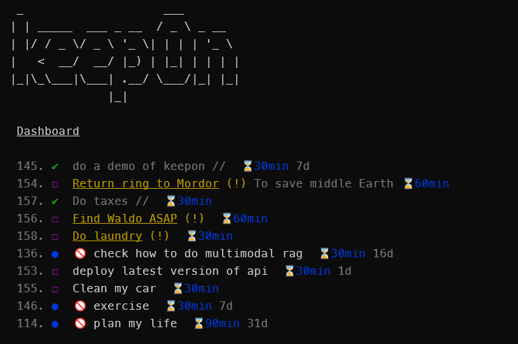
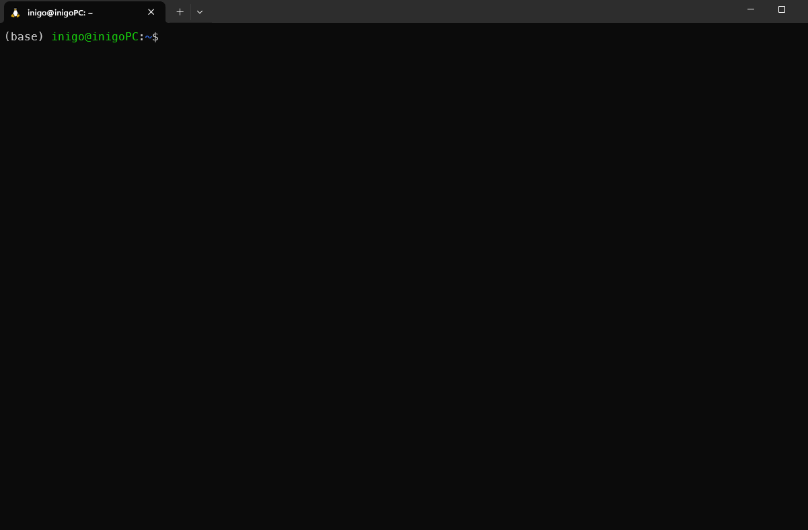

# keepOn

_Track your tasks and improve your time management with a simple cli._



# How it works

1. Add your tasks with the urgency, importance and estimated time in minutes
1. `keepOn` will prioritize those tasks base on your inputs and tell you which task to do next

   

# Install

```
npm install -g .
```

# Usage

See all commands with `k -h`

```sh
$ k -h
Usage: k [options] [command]

Options:
  -h, --help                                                           display help for command

Commands:
  show [options]                                                       Show all tasks
  block <id>                                                           Set the status of a task to blocked
  check <id>                                                           Check/uncheck task
  clear                                                                Clear all completed tasks
  create <title> [description] [urgency] [importance] [estimatedTime]  Create a new task
  get <id>                                                             Get all info of a task
  start <id>                                                           Start a task
  update [options] <id>                                                Update a task
  agenda|a                                                             Show the agenda of today as if you had to do all the tasks today
  help [command]                                                       display help for command
```

If no command is passed, by default it will show the dashboard (`k show` command).


# How the priority is calculated

The priority gives the order in the dashboard. It is calculated based on the urgency, the estimated time and importance of the task. The formula is:

```
priority = urgency * importance / estimatedTime
```

# Inspired by

- [Taskbook](https://github.com/klaudiosinani/taskbook)
